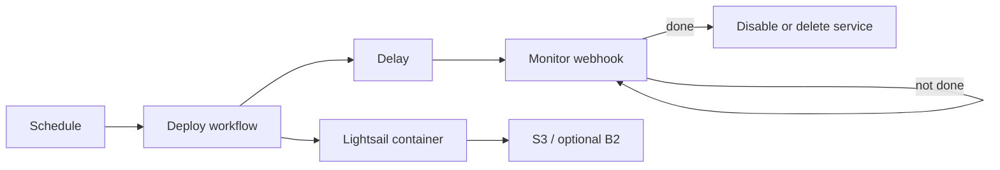

# Pipedream + Lightsail Database Backup

> **Use this template** on GitHub to create your own backup repository.

Read the full walkthrough: [How I built a serverless PostgreSQL backup system for AWS Lightsail that costs almost nothing](https://medium.com/@praveenluke/how-i-built-a-serverless-postgresql-backup-system-for-aws-lightsail-that-costs-almost-nothing-5a186505b8f0).

This template runs scheduled database backup or restore jobs as short-lived AWS Lightsail containers orchestrated by Pipedream. A Deploy workflow starts the selected dump/restore image, waits, and calls a Monitor workflow; the monitor checks completion, verifies backups in Amazon S3 and optionally Backblaze B2, then disables or deletes the container service to limit idle cost.

## Architecture

## Quick start

- Create this repository from the GitHub template, then clone it.
- Review the prerequisites and least-privilege IAM sketch in [`docs/setup.md`](docs/setup.md).
- Create the Monitor workflow and copy its HTTP webhook URL as described in [`docs/setup.md`](docs/setup.md).
- Create the scheduled Deploy workflow and configure variables from [`.env.example`](.env.example).
- Run and verify your first backup by following [`docs/setup.md`](docs/setup.md).

## Postgres vs MySQL

The same Deploy and Monitor workflows support either database engine. Set `DOCKER_IMAGE` to a compatible dump/restore image and provide the DB environment variables that image expects. Use `DB_PORT=5432` and the Postgres variables for Postgres; use `DB_PORT=3306` and a MySQL image implementing the same expected environment contract for MySQL. See [`.env.example`](.env.example) for both configurations.

## Workflows

| Workflow | Path | Purpose |
| --- | --- | --- |
| Deploy | [`workflows/deploy`](workflows/deploy) | Creates or enables the Lightsail service and deploys the backup/restore container. |
| Monitor | [`workflows/monitor`](workflows/monitor) | Polls job status, verifies backup output, and disables or deletes the service. |

## Author

Created by **PraveenLuke**. Read the [Medium article](https://medium.com/@praveenluke/how-i-built-a-serverless-postgresql-backup-system-for-aws-lightsail-that-costs-almost-nothing-5a186505b8f0) for the implementation story and walkthrough.

## License

[MIT](LICENSE)
